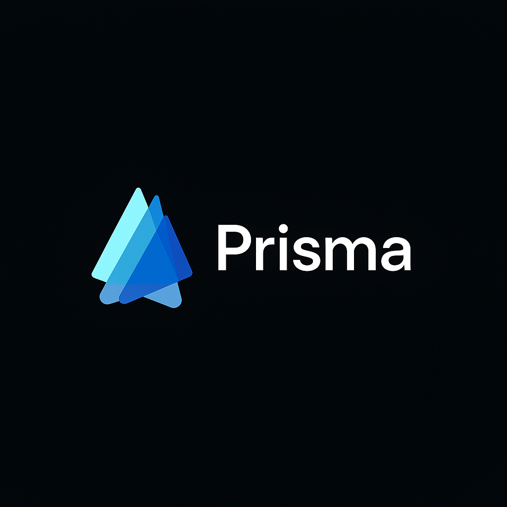

<p align="center">
  <picture>
    <source media="(prefers-color-scheme: dark)" srcset="Assets/Logo.png">
    
  </picture>
</p>

<h1 align="center">Prisma · Recorrido virtual del INSM</h1>

<p align="center">
  Conocé el <b>Instituto Nuestra Señora de la Merced</b> (Arroyito, Córdoba) sin salir de tu casa:<br>
  caminá por sus aulas, patios y salas en 3D, desde la compu o con un visor de realidad virtual.
</p>

<p align="center">
  <a href="https://insm.com.ar"><b>🌐 Probalo en insm.com.ar</b></a> ·
  <a href="../../releases"><b>📦 Descargas (Web y Android)</b></a>
</p>

---

## ¿Qué es Prisma?

**Prisma** es una experiencia de **realidad virtual** que reproduce el edificio del colegio para que cualquier persona pueda recorrerlo a distancia: familias que están pensando en inscribirse, ex alumnos, o quien quiera conocerlo.

Nació como proyecto de una materia y terminó publicado en la web oficial del colegio, **[insm.com.ar](https://insm.com.ar)**, que también se desarrolló como parte del proyecto.

Se puede usar de estas formas:

| Plataforma | Cómo se usa | Controles |
|---|---|---|
| 🖥️ **Web (WebGL)** | Desde el navegador, en [insm.com.ar](https://insm.com.ar) → bajando hasta la sección **"Recorrido Virtual"** | Teclado y mouse (o joystick) |
| 📱 **Android + visor Cardboard** | Instalando la app en el celular y poniéndolo en un visor VR | Movimiento de cabeza + joystick bluetooth |
| 🧪 **Web de prueba (itch.io)** | Versión de testeo en [eugenio-navarro.itch.io/prismaweb](https://eugenio-navarro.itch.io/prismaweb) | Teclado y mouse (o joystick) |

### 📦 Descargas

Las versiones listas para usar están en la sección **[Releases](../../releases)** de este repositorio (a la derecha de la página principal, o en *Releases → Latest*). En cada versión, dentro de **Assets**, vas a encontrar:

| Archivo | Qué es | Cómo se usa |
|---|---|---|
| `PrismaINSM-Android-vX.X.apk` | La app para celulares Android (10 o superior) | Descargalo en el celular, abrilo y aceptá *instalar apps de origen desconocido*. Después poné el celular en un visor Cardboard. |
| `PrismaINSM-Web-vX.X.zip` | La versión web (`index.html` + carpeta `Build/`) | Es lo que se sube al hosting de insm.com.ar. **No funciona con doble clic** en `index.html`: necesita un servidor web (ver [sección 7](#7-generar-las-builds-web-y-android)). Para simplemente probarla, usá la web. |
| `Source code (zip / tar.gz)` | Copia del código de esa versión (la agrega GitHub sola) | Solo sirve para ver cómo estaba el proyecto en ese momento. Para trabajar, cloná el repositorio ([sección 2](#2-descargar-y-abrir-el-proyecto)). |

### Lugares que se pueden recorrer

Sala de aulas (escena principal) · Aulas de 1ro a 6to (A y B) · Antesala · Biblioteca · Capilla · Comedor · Dirección · Fotocopiadora · Kiosco · Patio primario · Playón · Portería · Sala de informática.

---

## Índice

1. [Qué necesitás instalar](#1-qué-necesitás-instalar)
2. [Descargar y abrir el proyecto](#2-descargar-y-abrir-el-proyecto)
3. [Cómo está organizado](#3-cómo-está-organizado)
4. [Cómo funciona por dentro](#4-cómo-funciona-por-dentro)
5. [Controles](#5-controles)
6. [Tareas comunes (recetas)](#6-tareas-comunes-recetas)
7. [Generar las builds (Web y Android)](#7-generar-las-builds-web-y-android)
8. [Trabajar en equipo con Git](#8-trabajar-en-equipo-con-git)
9. [Problemas frecuentes](#9-problemas-frecuentes)
10. [Recursos de terceros](#10-recursos-de-terceros)

---

## 1. Qué necesitás instalar

| Programa | Para qué | Dónde |
|---|---|---|
| **Unity Hub** | Administra las versiones de Unity | [unity.com/download](https://unity.com/download) |
| **Unity 2022.3.62f1** (LTS) | El motor con el que está hecho el proyecto | Desde Unity Hub → *Installs* → *Install Editor* → pestaña *Archive* |
| Módulo **WebGL Build Support** | Para exportar a la web | Se tilda al instalar Unity (o después: *Installs* → ⚙️ → *Add modules*) |
| Módulo **Android Build Support** (con *OpenJDK* y *Android SDK & NDK*) | Para exportar la app de Android | Igual que el anterior |
| **Visual Studio 2022** (o VS Code) | Para editar los scripts en C# | Unity Hub lo ofrece al instalar |
| **Git** | Para descargar el proyecto y subir cambios | [git-scm.com](https://git-scm.com/) |
| **GitHub Desktop** *(opcional, recomendado si recién empezás)* | Usar Git con botones en vez de comandos | [desktop.github.com](https://desktop.github.com/) |

> ⚠️ **Usá exactamente la versión 2022.3.62f1.** Abrirlo con otra versión puede romper escenas o paquetes. Si Unity te pregunta si querés "actualizar" el proyecto, decí que **no**.

---

## 2. Descargar y abrir el proyecto

### Opción A — Con GitHub Desktop (más fácil)

1. En esta página, botón verde **`<> Code`** → **Open with GitHub Desktop**.
2. Elegí una carpeta **con una ruta corta y sin espacios raros** (ej: `C:\Proyectos\`) y clonalo.
3. Abrí **Unity Hub** → **Add** → **Add project from disk** → elegí la carpeta `PrismaINSM`.
4. Abrilo. **La primera vez tarda bastante** (10–30 minutos): Unity está generando la carpeta `Library`. Es normal.

### Opción B — Con la terminal

```bash
git clone https://github.com/eugenio-navarro/PrismaINSM.git
```

Y después los pasos 3 y 4 de arriba.

> 💡 No uses el botón **Download ZIP** si vas a hacer cambios: perdés el historial y no vas a poder subir tus cambios.

### Primera vez adentro de Unity

1. En la ventana **Project**, abrí `Assets/SchoolResources/Models/SalaAulas/Scene/SalaAulas.unity` (doble clic). Es la **escena inicial**.
2. Apretá ▶️ **Play**. En el editor siempre se usa el jugador de PC (teclado y mouse).
3. Para salir del modo "mouse bloqueado", apretá `Esc`.

---

## 3. Cómo está organizado

```
PrismaINSM/
├── Assets/                         ← TODO el contenido del proyecto
│   ├── Logo.png / LogoNegro.png    ← Logos de Prisma
│   ├── SchoolResources/            ← ⭐ Lo nuestro: acá se trabaja
│   │   ├── Models/                 ← Un sector del colegio por carpeta
│   │   │   └── Biblioteca/
│   │   │       ├── Models/         ← Modelo 3D (.fbx) del lugar
│   │   │       ├── Photos/         ← Fotos reales usadas como texturas
│   │   │       └── Scene/          ← La escena (.unity) de ese lugar
│   │   ├── ExtraModels/            ← Objetos 3D descargados (matafuegos, ventilador, timbre…)
│   │   ├── ExtraAssets/            ← Más objetos 3D (sillas, monitores, teclados…) ⚠️ se usan en las aulas
│   │   ├── Prefabs/                ← Objetos reutilizables: jugadores y cartel de interacción
│   │   ├── Scripts/                ← El código C# del proyecto
│   │   ├── PlayerControls.inputactions  ← Definición de controles
│   │   └── PlayerControls.cs       ← Generado automáticamente a partir del anterior (no editar)
│   ├── Plugins/Android/            ← Configuración especial para compilar Android
│   ├── Samples/                    ← Ejemplo oficial de Google Cardboard
│   ├── TextMesh Pro/               ← Paquete de Unity para textos
│   ├── WebGLTemplates/MinimalFixed ← Página HTML que envuelve la versión web
│   └── XR/                         ← Configuración de realidad virtual
├── Packages/
│   ├── manifest.json               ← Lista de paquetes que usa el proyecto
│   └── cardboard-xr-plugin-1.22.0/ ← Plugin de Google Cardboard (incluido en el repo)
└── ProjectSettings/                ← Configuración general (escenas del build, nombre, etc.)
```

**Regla de oro:** trabajá dentro de `Assets/SchoolResources/`. Las otras carpetas casi nunca hace falta tocarlas.

Carpetas que **no** están en el repo (Unity las crea solo): `Library/`, `Temp/`, `Logs/`, `obj/`, `UserSettings/`, `Build/` y los archivos `.sln` / `.csproj`.

---

## 4. Cómo funciona por dentro

### La idea general

- **Cada sector del colegio es una escena** de Unity distinta. La escena principal es **SalaAulas**, y desde ahí se va pasando a las demás a través de **puertas**.
- Cada escena tiene **dos jugadores**: uno para **PC/Web** y otro para **VR**. Al arrancar, un script decide cuál activar según la plataforma.
- Los modelos de los lugares se texturizaron con **fotos reales** del colegio (carpetas `Photos/`).

```
            ┌──────────────┐   puerta    ┌──────────────┐
  inicio ──►│  SalaAulas   │────────────►│  Biblioteca  │ ...
            └──────────────┘◄────────────└──────────────┘
                   │
       PlatformLoader decide:
       ├─ Web / Editor  → PlayerPC  (teclado + mouse)
       └─ Android       → PlayerVR  (Cardboard + joystick)
```

### Tecnologías usadas

| Qué | Para qué |
|---|---|
| **Unity 2022.3 LTS** (pipeline de render *Built-in*) | Motor del proyecto |
| **C#** | Lenguaje de los scripts |
| **Input System** (el "nuevo" sistema de entrada) | Teclado, mouse y joysticks |
| **Google Cardboard XR Plugin 1.22** | Visión estereoscópica y seguimiento de cabeza en Android |
| **TextMesh Pro** | Textos de la interfaz |
| **glTFast** | Importar modelos en formato glTF |
| **WebGL** | Versión que corre en el navegador |

### Los scripts (`Assets/SchoolResources/Scripts/`)

| Archivo | Clase adentro | Qué hace |
|---|---|---|
| `GameManager.cs` | `PlatformLoader` | Activa **PlayerPC** en Web y en el editor, y **PlayerVR** en Android. |
| `PlayerControllerPC.cs` | `PCPlayerController` | Caminar, correr, saltar y mirar con el mouse (PC/Web). |
| `PlayerControllerVR.cs` | `VRPlayerController` | Caminar, correr y saltar en VR (la cabeza la maneja Cardboard). |
| `DoorInteractor.cs` | `DoorInteractor` | Puertas: al acercarte aparece un círculo; **mantené** el botón hasta llenarlo y te lleva a otra escena. |
| `BellInteractor.cs` | `AudioInteractor` | Igual que la puerta, pero en vez de cambiar de escena **reproduce un sonido** (ej. el timbre). |
| `MenuManager.cs` | `MenuManager` | Abre/cierra el menú para saltar directo a cualquier sala. |
| `AutoScroll.cs` | `AutoScroll` | Hace que la lista del menú se desplace sola cuando se navega con joystick. |
| `SceneLoader.cs` | `SceneLoader` | Función que usan los botones del menú para cargar una escena por nombre. |
| `InteractiveObject.cs` | `InteractiveObject` | Eventos genéricos (mirar / dejar de mirar / clic) para objetos con la retícula de Cardboard. |


### Prefabs importantes (`Assets/SchoolResources/Prefabs/`)

- **PlayerPC** → jugador para compu/web.
- **PlayerVR** → jugador para Cardboard.
- **PickupPromptCanvas** → el cartel con el círculo de progreso que aparece al acercarse a una puerta o al timbre.
- Los que dicen **Obsoleto** son versiones viejas; no se usan.

> 💡 Si modificás un **prefab** (doble clic en él), el cambio se aplica en **todas** las escenas donde aparece. Si lo modificás adentro de una escena, solo cambia ahí (salvo que uses *Overrides → Apply All*).

---

## 5. Controles

Definidos en `Assets/SchoolResources/PlayerControls.inputactions` (doble clic para editarlos visualmente).

| Acción | Teclado / mouse | Joystick |
|---|---|---|
| Moverse | `W` `A` `S` `D` | Stick izquierdo |
| Mirar | Mouse | — (en VR se mira con la cabeza) |
| Correr | `Shift` izquierdo | Apretar stick izquierdo |
| Saltar | `Espacio` | Botón inferior (A / ✕) |
| Interactuar (mantener) | `E` | Botón derecho (○ en joystick tipo PlayStation) |
| Navegar el menú | Flechas | Cruceta / stick izquierdo |
| Confirmar en el menú | `Enter` | Botón inferior (A / ✕) |


---

## 6. Tareas comunes (recetas)

### ➕ Agregar un lugar nuevo del colegio

1. Creá la carpeta `Assets/SchoolResources/Models/<NombreDelLugar>/` con subcarpetas `Models`, `Photos` y `Scene` (copiá la estructura de otro lugar).
2. Importá el modelo 3D (`.fbx`) en `Models/` y las fotos en `Photos/`.
3. La forma más fácil de armar la escena: **duplicá una escena existente** (`Ctrl + D` sobre el `.unity`), movela a tu carpeta `Scene/`, renombrala y reemplazá el modelo del lugar. Así ya tenés los jugadores, la luz y el `PlatformLoader` configurados.
4. Agregá la escena al build: **File → Build Settings → Add Open Scenes**. *Si no está en esta lista, las puertas no la pueden cargar.*
5. Poné una **puerta** que lleve a esa escena (ver la receta siguiente) y otra que vuelva.
6. Si corresponde, sumá un botón en el menú de salas que llame a `SceneLoader.LoadSceneByName("<NombreDeLaEscena>")`.

### 🚪 Crear una puerta hacia otra escena

1. Creá un objeto vacío (o usá la puerta del modelo) y agregale un **Box Collider** con **Is Trigger** tildado. Ese es el área donde el jugador "llega" a la puerta.
2. Agregale el componente **DoorInteractor**.
3. Completá en el Inspector:
   - **Scene To Load** → el nombre **exacto** de la escena (con tildes y mayúsculas, ej: `Dirección`).
   - **Interact Action** → la acción `Gameplay/Interact` de `PlayerControls`.
   - **Interaction Canvas** y **Progress Fill Image** → arrastrá una instancia del prefab `PickupPromptCanvas` y su imagen `ProgressFill`.
4. Asegurate de que el jugador tenga el **Tag `Player`**: la puerta solo reacciona a objetos con ese tag.

### 🔔 Agregar un objeto que suena (como el timbre)

Igual que la puerta, pero con el componente **AudioInteractor** (archivo `BellInteractor.cs`) y un **Audio Clip** asignado (ej. `Models/SalaAulas/Timbre.mp3`). A diferencia de la puerta, acá hay que arrastrar el jugador al campo **Player Object**. Tildá **Play Once** si solo tiene que sonar una vez.

### 🪑 Agregar un objeto 3D decorativo

1. Descargá el modelo (por ejemplo de Sketchfab, **revisando que la licencia permita usarlo**) y ponelo en `ExtraModels/<nombre-del-objeto>/`.
2. Arrastralo a la escena. Si va a estar en muchas escenas, convertilo en **prefab**.
3. **Cuidado con el peso:** texturas de 4K y archivos `.zip`/`.rar` hacen el proyecto y la versión web mucho más pesados. En el Inspector de cada textura podés bajar el **Max Size** (1024 o 2048 suele alcanzar).

---

## 7. Generar las builds (Web y Android)

Las builds **no se guardan en el repositorio**: se publican en la sección **[Releases](../../releases)** de GitHub.

### 🌐 Versión Web (WebGL)

1. **File → Build Settings** → elegí **WebGL** → **Switch Platform** (tarda un rato).
2. Verificá que **SalaAulas** sea la primera escena de la lista (índice 0).
3. **Build** → elegí una carpeta **fuera** del proyecto (o `Build/`, que está ignorada).
4. El resultado (`index.html` + carpeta `Build/`) es lo que se sube al hosting de **insm.com.ar**.

Notas:
- Usa la plantilla `Assets/WebGLTemplates/MinimalFixed` (pantalla completa, sin bordes). Se elige en *Player Settings → Resolution and Presentation*.
- La build está **comprimida** (*Player Settings → Publishing Settings → Compression Format*). El servidor tiene que estar configurado para servir esos archivos; si la web muestra un error de carga, probá con **Compression Format: Disabled** o activá **Decompression Fallback**.
- **No se puede abrir con doble clic** en `index.html`: hay que servirla desde un servidor web (Unity lo hace solo con **Build And Run**).

### 📱 Versión Android (Cardboard)

1. **File → Build Settings** → **Android** → **Switch Platform**.
2. Conectá el celular por USB con la **Depuración USB** activada (Opciones de desarrollador).
3. **Build And Run** (instala directo) o **Build** (genera el `.apk` para compartir).

Datos de configuración actuales:
- Identificador: `com.Prisma.PrismaINSM`
- Android mínimo: **10 (API 29)**
- Plugin XR: **Cardboard** (*Project Settings → XR Plug-in Management → Android*)

### 🚀 Publicar una nueva versión en GitHub

1. En GitHub: **Releases → Draft a new release**.
2. Tag: `v1.1` (o el número que siga).
3. Adjuntá `PrismaINSM-Android-v1.1.apk` y `PrismaINSM-Web-v1.1.zip` (la carpeta WebGL comprimida).
4. Escribí brevemente qué cambió y publicá.

---

## 8. Trabajar en equipo con Git

Unity y Git se llevan bien si se respetan algunas reglas:

1. **Siempre subí los archivos `.meta` junto con su archivo.** Son los que conectan las cosas entre sí. Si falta un `.meta`, aparecen objetos rosas o referencias rotas.
2. **Hacé *pull* antes de empezar a trabajar** para tener la última versión.
3. **Dos personas NO deben editar la misma escena a la vez.** Las escenas (`.unity`) son muy difíciles de combinar. Avísense antes (por ejemplo: "hoy toco Biblioteca").
4. **Usen ramas**: una rama por tarea (`agregar-laboratorio`, `arreglar-puerta-capilla`) y un *Pull Request* para sumarla a `main`.
5. **Commits chicos y con mensajes claros**: `Agrego escena Laboratorio` es mejor que `cambios`.
6. **No subas builds** (`.apk`, carpetas WebGL) al repo: van a *Releases*.
7. **Cuidado con archivos gigantes**: GitHub no acepta archivos de más de **100 MB** y avisa a partir de 50 MB. Si un modelo pesa mucho, reducilo antes de subirlo.

### Flujo básico con GitHub Desktop

```
Fetch origin / Pull  →  trabajar en Unity  →  guardar (Ctrl+S)
      →  revisar cambios en GitHub Desktop  →  escribir mensaje  →  Commit  →  Push origin
```

---

## 9. Problemas frecuentes

| Problema | Solución |
|---|---|
| Objetos **rosas/magenta** | Falta un material o textura (casi siempre un `.meta` que no se subió). Revisá que el compañero haya subido los `.meta`. |
| *"The associated script can not be loaded"* | Hay un error de compilación en algún script. Mirá la ventana **Console** y arreglá el primer error en rojo. |
| La puerta no lleva a ningún lado | El nombre en **Scene To Load** no coincide exacto, o la escena no está en **Build Settings**. |
| No aparece el círculo al acercarme | El collider no tiene **Is Trigger**, o el jugador no tiene el Tag `Player`. |
| Error del paquete **Cardboard** al abrir | Verificá que exista `Packages/cardboard-xr-plugin-1.22.0/` y que `Packages/manifest.json` diga `"file:cardboard-xr-plugin-1.22.0"`. |
| La web no carga en el navegador | Ver las notas de compresión en la [sección 7](#-versión-web-webgl). |
| Unity tarda muchísimo al abrir | Normal la primera vez (crea `Library/`). Las siguientes veces es rápido. |

---

## 10. Recursos de terceros

- **Modelos 3D:** los objetos de `ExtraModels/` y `ExtraAssets/` fueron descargados de repositorios de modelos 3D y pertenecen a sus respectivos autores (ver los archivos de licencia/`readme` dentro de cada carpeta cuando existan).
- **Plugins:** [Google Cardboard XR Plugin](https://github.com/googlevr/cardboard-xr-plugin) (Apache 2.0), TextMesh Pro y glTFast (Unity).

<p align="center"><a href="https://insm.com.ar">insm.com.ar</a></p>
